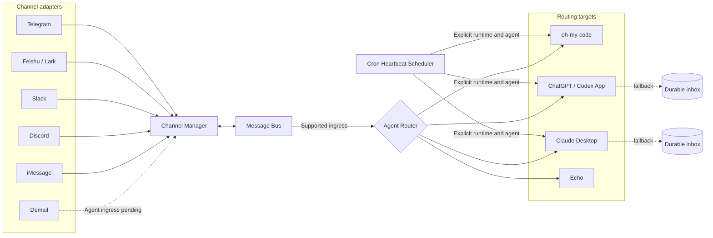

# FractalBot

[](https://opensource.org/licenses/MIT)
[](https://go.dev/)
[](https://github.com/fractalmind-ai/fractalbot/stargazers)

FractalBot is a local-first Go messaging gateway that connects chat channels to external agent runtimes through HTTP, CLI, and WebSocket interfaces.

## Capabilities

### Channels

| Channel | Inbound | Outbound | Transport and scope |
| --- | --- | --- | --- |
| Telegram | Yes | Yes | Long polling or webhook; DM-only and allowlisted. |
| Feishu / Lark | Yes | Yes | App credentials and user allowlist. |
| Slack | Yes | Yes | Socket Mode; DMs and configured channel mentions. |
| Discord | Yes | Yes | Gateway WebSocket; DM-only and allowlisted. |
| iMessage | Yes | Yes | macOS Messages database polling and AppleScript sending. |
| Demail | Transport only | Yes | Encrypted on-chain agent mail on Sui; generic Agent Router ingress is not yet enabled. |

### Routing targets

| Router | Target | Delivery model |
| --- | --- | --- |
| `ohMyCode` | oh-my-code agent-manager | Invokes the manager script in an existing workspace. |
| `codexAppCDP` | ChatGPT / Codex desktop app | Resolves a project session and calls the renderer's in-process app-server bridge through CDP. |
| `claudeDesktop` | Claude Desktop | Submits to an authenticated Claude chat exposed through CDP. |
| `grokBotApp` | Grok Bot.app | Optional Electron CDP or `grokbot:`/`sand:` open, with a required durable inbox fallback. |
| Legacy fallback | Echo | Echoes supported inbound text when no Agent Router is enabled. |

Desktop routes support durable file-backed inbox fallback when direct delivery is unavailable. Channel allowlists use deny-by-default behavior where supported.

## Architecture



The Gateway Server wires channel adapters, the buffered Message Bus, and the selected Agent Router. HTTP/CLI sends enter the outbound bus; normalized channel events enter the inbound bus. See [Architecture](docs/architecture.md) for component boundaries, message flows, and the current Demail ingress limitation.

## Quick start

Requires Go 1.23 or newer.

```bash
git clone git@github.com:fractalmind-ai/fractalbot.git
cd fractalbot
cp config.example.yaml config.yaml

# Edit config.yaml to enable and configure a channel and router.
go run ./cmd/fractalbot --config ./config.yaml
```

Verify the gateway:

```bash
curl -fsS http://127.0.0.1:18789/health
curl -sS http://127.0.0.1:18789/status | python3 -m json.tool
```

Send an outbound message through the running gateway:

```bash
go run ./cmd/fractalbot --config ./config.yaml \
  message send --channel telegram --to 1234567890 --text "hello"
```

Attach images (repeat `--image` for multiple; the current implementation supports Feishu):

```bash
go run ./cmd/fractalbot --config ./config.yaml \
  message send --channel feishu --to oc_xxx --text "架构对比图" \
  --image ./arch-compare.png --image ./loss-curve.png
```

SVG is not accepted for image send — convert to PNG/JPEG first. Channels without image support return an explicit error instead of dropping the attachment.

Start with [`config.example.yaml`](config.example.yaml), then read [Agent routing](docs/routing.md) for runtime-specific configuration.

## Documentation

- [Architecture](docs/architecture.md)
- [Agent routing](docs/routing.md)
- [Agent heartbeats](docs/heartbeat.md)
- [Development and local demo](docs/development.md)
- [Troubleshooting](docs/troubleshooting.md)
- [Slack setup](docs/slack.md)
- [Discord setup](docs/discord.md)
- [iMessage setup](docs/imessage.md)
- [Chinese guide](docs/guide-zh.md)

## Development

```bash
make build
make test
make vet
```

See [Development](docs/development.md) for the project layout, WebSocket smoke test, local demo, and cross-platform builds. Contributions should follow [CONTRIBUTING.md](CONTRIBUTING.md).

## License

FractalBot is available under the [MIT License](LICENSE).
