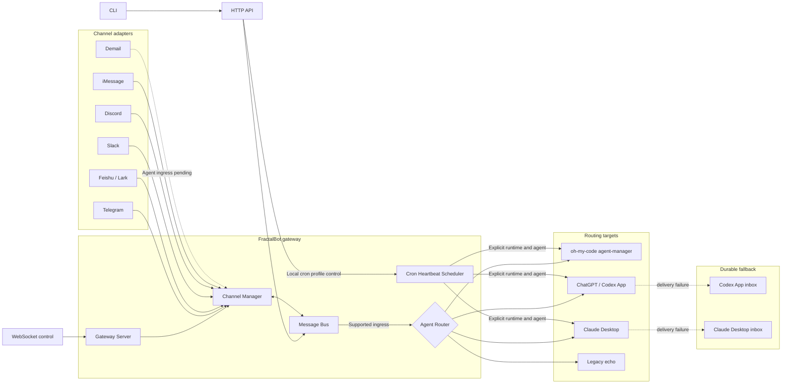

# Architecture

FractalBot is a local-first messaging gateway. Channel-specific adapters normalize inbound messages, a buffered in-process bus decouples transport from routing, and one selected Agent Router delivers each task to an external runtime.

## System overview

## Components

| Component | Responsibility |
| --- | --- |
| Gateway server | Owns `/health`, `/status`, `/ws`, and `/api/v1/message/send`; wires the runtime together. |
| Channel Manager | Registers enabled adapters, gives each adapter an isolated lifecycle context, and sends outbound messages through per-channel workers. |
| Message Bus | Buffers inbound and outbound work while preserving the synchronous reply contract used by channel adapters. |
| Agent Manager | Applies the configured router, validates the selected agent, records routing telemetry, and returns an acknowledgement or reply. |
| Heartbeat Scheduler | Calculates explicit-timezone cron jobs, persists effective profiles, and dispatches autonomous wakeups directly to a configured Runtime and Agent. |
| Channel adapters | Handle transport authentication, allowlists, normalization, provider-specific replies, and telemetry. |

The six registered adapters are Telegram, Feishu/Lark, Slack, Discord, iMessage, and Demail. The first five currently enter the generic Agent Router. Demail is a bidirectional transport adapter, but its normalized `demail` messages are currently ignored by `agent.Manager.HandleIncoming`; generic Demail-to-agent routing is not yet enabled.

## Inbound flow

1. An enabled adapter receives a provider event and applies its allowlist and channel-specific validation.
2. The adapter converts the event to a shared protocol message and publishes it through the Message Bus.
3. The Agent Manager accepts supported channel messages, wraps large bodies when needed, and validates `/agent <name>` selection.
4. The active router delivers to oh-my-code, the ChatGPT/Codex desktop app, or Claude Desktop. With no enabled router, the legacy behavior echoes the text.
5. The adapter sends the returned acknowledgement or reply to the original conversation.

## Outbound flow

The CLI calls the gateway's HTTP send endpoint. HTTP and in-process callers publish an outbound envelope to the Message Bus, which selects the named channel and sends through its worker. Workers isolate provider rate limiting and return provider metadata such as message and thread IDs when available.

## Heartbeat flow

Heartbeat jobs bypass the selected Agent Router and address `ohMyCode`, `codexAppCDP`, `claudeDesktop`, or `grokBotApp` explicitly. The scheduler sends an autonomous envelope with job, run, schedule, expiry, target Agent, and inline instruction metadata. It does not synthesize a channel or chat identity and never sends a channel acknowledgement.

Desktop fallback inboxes coalesce queued heartbeats by job so an unavailable app does not accumulate stale wakeups. Agents normally do not report back to the scheduler. Only an Agent that finds no actionable work may select an operator-approved lower-frequency cron profile through the loopback API; matching user activity can restore the configured default cron. See [Agent heartbeats](heartbeat.md).

## Reliability and security boundaries

- Channel lifecycles are isolated so one adapter stopping or panicking does not cancel the others.
- Channel allowlists default to deny where supported; Slack, Discord, and Telegram also constrain the accepted conversation shapes.
- The desktop routers can atomically queue normalized envelopes to private inbox directories when CDP delivery is unavailable.
- The Codex App router exposes readiness, resolved conversation, repair attempts, and last-routing telemetry through `/status`.
- WebSocket origins can be restricted with `gateway.allowedOrigins`.
- FractalBot does not store channel tokens outside the operator-provided configuration.

See [Routing](routing.md) for router-specific behavior and configuration.
